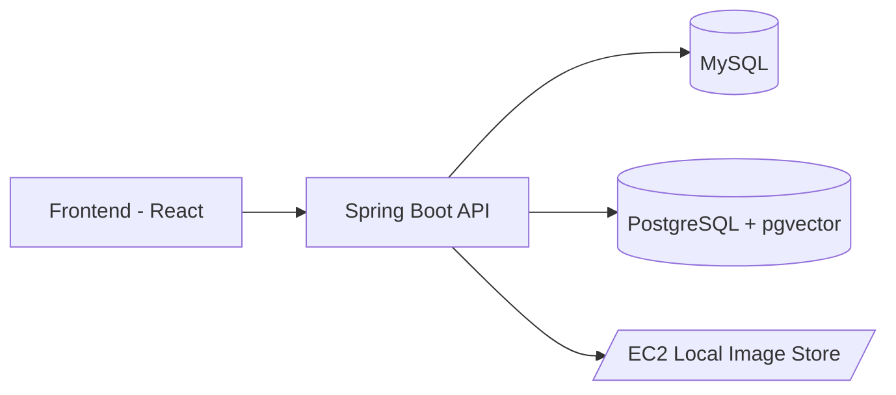

# 🎉 오늘도 축제로다 (Everyday Festival)


> 지역 축제 정보의 **파편화 문제**를 해결하고, 축제 **주최자(Holder)**, **참여 업체(Company)**, **단기 노동자(Labor)** 를 연결하는 매칭/지원 플랫폼

- **개발 기간**: 2025.07.21 ~ 2025.08.21
- **팀 구성**: 백엔드 3, 프론트엔드 2, 디자이너 1
- **내 역할**: 엔티티 설계, 아키텍처, DB, API, 배포

---

## 🗂️ 목차
- [프로젝트 개요](#-프로젝트-개요)
- [핵심 기능](#-핵심-기능)
- [기술 스택](#-기술-스택)
- [아키텍처](#-아키텍처)
- [환경 변수](#환경-변수)
- [트러블 슈팅](#트러블-슈팅)
- [결과](#결과)


---

## 📌 프로젝트 개요
- **문제 정의**: 축제 정보가 여러 매체에 흩어져 접근성이 낮음 → 사용자들이 **원스톱 조회/지원**을 원함  
- **해결 전략**:  
  1) 도시/구/키워드 기반 정교한 검색  
  2) **pgvector**를 활용한 임베딩 기반 유사도 추천  
  3) 모집 공고(업체/노동)–지원서–선발 관리 전 과정 제공

---

## 🚀 트러블슈팅
- [x] 축제/업체 검색 (정렬/페이지네이션)
- [x] 임베딩 기반 유사 검색 (pgvector)
- [x] 모집 공고 CRUD (CompanyRecruit / LaborRecruit)
- [x] 지원서 작성/조회 (모집중/완료 상태 필터)
- [x] 좋아요 등록/해제
- [x] 축제 -> 업체 관심 보내기
- [x] 리뷰/평가
- [x] 이미지 업로드 (EC2 로컬 스토리지 → 외부 URL 제공)
- [x] JWT 기반 인증/인가

---

## 🛠 기술 스택
**Backend**
- Java 21, Spring Boot 3.5.4  
- Spring Data JPA, QueryDSL, Hibernate Validator  
- Spring Security (JWT)  
- Gradle 8.x

**Database**
- MySQL (트랜잭션 데이터)  
- PostgreSQL + **pgvector** (추천/검색 임베딩)

**Infra / DevOps**
- AWS EC2 (Ubuntu), DuckDNS (도메인)  
- Vercel (Frontend), GitHub Actions (CI 일부)  
- `nohup` 기반 백그라운드 실행

**Collaboration**
- GitHub Org, PR 리뷰, Notion, Figma, Postman

---

## 🏛 아키텍처


---
## 환경 변수
```
export CORE_DB_PASSWORD=
export CORE_DB_URL=jdbc:mysql://localhost:3306/festival_core
export CORE_DB_USERNAME=festival
export CORE_DB_PASSWORD=Festival123!@# 
export IMAGE_URL=/home/ec2-user/images/
export DUMMY_FESTIVAL_URL=/home/ec2-user/dummy/festival
export DUMMY_USER_URL=/home/ec2-user/dummy/user

export JWT_ISSUER=everyday.festival
export JWT_SECRET_KEY=...
export OPENAI_API_KEY=sk-proj-...
export VECTOR_DB_PASSWORD=Festival123!@#
export VECTOR_DB_URL=jdbc:postgresql://localhost:5432/festival_vector
export VECTOR_DB_USERNAME=festival
```
---
## 트러블 슈팅
<details><summary>식별자는 정렬과 전혀 무관하다.</summary>
  
extraQuestions는 처음에 값타입 컬렉션으로 설계하였다.
질문의 순서를 따라 답변을 대응시키고 출력할 계획이므로, 컬렉션 내부 순서가 중요하다.
따라서 정렬을 위해 일대다 관계로 전환하고 별도 테이블을 생성했다.
라고 잘못된 생각을 했었다.

결론부터 말하면 ID는 식별자일 뿐, 정렬의 요소로 사용해선 안된다.
언뜻 보면 삽입한 순서대로 증가하기에 정렬에 적절해 보인다.
하지만, ID는 반드시 순서대로 증가하는 것이 아니다.

중간 값 삭제
1, 2, 3 순서대로 존재하는 데이터에서 2를 제거하면 id는 1, 3이 된다.
3이 2가 되지 않는다.

DB, 전략마다 다름
DB 종류와 DDL에서 지정하는 키 생성 전략마다 키 값 할당 방식이 모두 다르다.

JPA 내부 로직
JPA는 같은 엔티티 타입별로 모아서 flush() 한다.
이때, List가 아닌 Map을 사용해서 모아둔 후 DB에 쿼리를 전송한다.
이 과정에서 순서가 뒤섞인다.

-> @OrderColumn을 사용해서 순서와 관련된 별도 컬럼을 생성해야 한다.
</details>
<details><summary>테스트 클래스는 protected 생성자를 호출할 수 있다.</summary>
나는 모든 엔티티에서 의도하지 않은 생성을 막고자 @NoArgs...를 protected,
생성자를 private 으로 선언하고, 정적 팩토리 메서드만을 공개했다.
그런데 IDE가 테스트 클래스에서 new xxxConstructor(); 를 자동완성으로 제시했다.

파라미터 없는 기본 생성자는 protected로 막아두었기에
같은 클래스, 같은 패키지, 자식 클래스 에서만 호출 가능하다.

1. 테스트 클래스는 자식 클래스인가? <br/>
```
Class<?> clazz = FestivalTest.class;
Class<?> superClass = clazz.getSuperclass();
System.out.println("상위 클래스: " + superClass.getName());
```
위 코드는 바로 위 부모 클래스를 조회한다.

상위 클래스: java.lang.Object
모든 클래스는 Object를 상속하므로, 사실상 아무 클래스도 상속하지 않는 셈이다.

2.테스트 클래스는 같은 클래스인가? <br/>
`this.getClass() = class com.festival.everyday.core.domain.FestivalTest`
다른 클래스였다.

그런데, 클래스 확인 출력 결과에서 이상한 점을 발견했다.
두 클래스의 패키지가 동일하다.
인텔리제이 프로젝트 계층 구조에 의하면, 두 클래스는 main, test로 나뉜다.
이는 디렉토리 와 패키지 를 동일시해서 발생하는 오해였다.

테스트와 클래스를 같은 패키지에 배치한 것은 의도된 설계였다.
우리는 정적 팩토리 메서드와 private, protected 생성자를 통해 단일 공통 진입점을 설계하였다.
또한 해당 메서드에서 검증 로직을 삽입하여 무결성(불변 조건)을 보장하였다.
다르게 말하면 정해진 방식으로는 테스트를 위해 엔티티에 의도적으로 잘못된 값을 발생시킬 수 없다.
따라서 막아둔 protected 생성자를 테스트에서 사용하여 검증을 우회하기 위해 같은 패키지에 배치하였다.
</details>

<details><summary>N + 1</summary>
사실 트러블 슈팅 작성을 위해 억지로 `N + 1` 문제를 발생시켜야 하나 고민했지만 <br/>
솔직히 쓰자면 미리 관련 문제에 대해 학습을 한 후 프로젝트를 진행하였기에 <br/>
`fetch join`과 `batch size` 전략 그리고 `projection`을 적극적으로 사용하여 <br/>
본 프로젝트에서 `N + 1` 문제는 발생하지 않았다.

</details>

---

## 배포
`ssh -i hackathon_server105.pem ec2-user@43.201.6.192`

---
## 결과
[](./docs/presentation.pdf)
