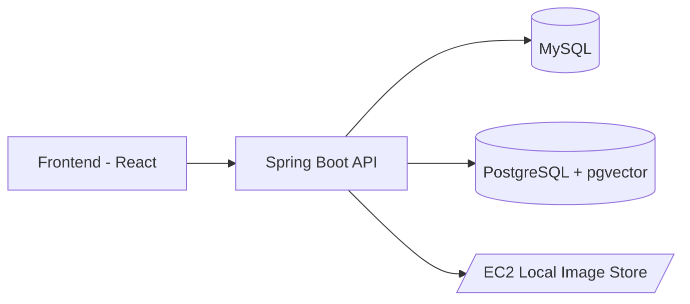

# 🎉 오늘도 축제로다 (Everyday Festival)


> 지역 축제 정보의 **파편화 문제**를 해결하고, 축제 **주최자(Holder)**, **참여 업체(Company)**, **단기 노동자(Labor)** 를 연결하는 매칭/지원 플랫폼

- **개발 기간**: 2025.07.21 ~ 2025.08.21
- **팀 구성**: 백엔드 3, 프론트엔드 2, 디자이너 1
- **내 역할**: 백엔드 설계/구현 100% (아키텍처, DB, 보안, API, 배포)

---

## 🗂️ 목차
- [프로젝트 개요](#-프로젝트-개요)
- [핵심 기능](#-핵심-기능)
- [기술 스택](#-기술-스택)
- [아키텍처](#-아키텍처)
- [ERD (요약)](#-erd-요약)
- [환경 변수](#-환경-변수)
- [핵심 이슈 & 해결](#-핵심-이슈--해결)
- [스크린샷](#-스크린샷)


---

## 📌 프로젝트 개요
- **문제 정의**: 축제 정보가 여러 매체에 흩어져 접근성이 낮음 → 사용자들이 **원스톱 조회/지원**을 원함  
- **해결 전략**:  
  1) 도시/구/키워드 기반 정교한 검색  
  2) **pgvector**를 활용한 임베딩 기반 유사도 추천  
  3) 모집 공고(업체/노동)–지원서–선발 관리 전 과정 제공

---

## 🚀 핵심 기능
- [x] 축제/업체 검색 (정렬/페이지네이션)
- [x] 임베딩 기반 유사 검색 (pgvector)
- [x] 모집 공고 CRUD (CompanyRecruit / LaborRecruit)
- [x] 지원서 작성/조회 (모집중/완료 상태 필터)
- [x] 좋아요 등록/해제
- [x] 축제 -> 업체 관심 보내기
- [x] 리뷰/평가
- [x] 이미지 업로드 (EC2 로컬 스토리지 → 외부 URL 제공)
- [x] JWT 기반 인증/인가

---

## 🛠 기술 스택
**Backend**
- Java 21, Spring Boot 3.5.4  
- Spring Data JPA, QueryDSL, Hibernate Validator  
- Spring Security (JWT)  
- Gradle 8.x

**Database**
- MySQL (트랜잭션 데이터)  
- PostgreSQL + **pgvector** (추천/검색 임베딩)

**Infra / DevOps**
- AWS EC2 (Ubuntu), DuckDNS (도메인)  
- Vercel (Frontend), GitHub Actions (CI 일부)  
- `nohup` 기반 백그라운드 실행

**Collaboration**
- GitHub Org, PR 리뷰, Notion, Figma, Postman

---

## 🏛 아키텍처


---
## 환경 변수
```
export CORE_DB_PASSWORD=
export CORE_DB_URL=jdbc:mysql://localhost:3306/festival_core
export CORE_DB_USERNAME=festival
export CORE_DB_PASSWORD=Festival123!@# 
export IMAGE_URL=/home/ec2-user/images/
export DUMMY_FESTIVAL_URL=/home/ec2-user/dummy/festival
export DUMMY_USER_URL=/home/ec2-user/dummy/user

export JWT_ISSUER=everyday.festival
export JWT_SECRET_KEY=...
export OPENAI_API_KEY=sk-proj-...
export VECTOR_DB_PASSWORD=Festival123!@#
export VECTOR_DB_URL=jdbc:postgresql://localhost:5432/festival_vector
export VECTOR_DB_USERNAME=festival
```
---
## 트러블 슈팅
---

## 배포
ssh -i hackathon_server105.pem ec2-user@43.201.6.192

---
## 결과
